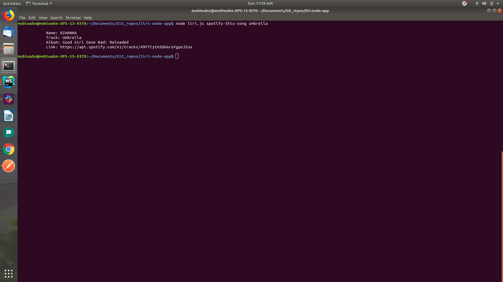

# My Cousin Liri

Meet Liri; Siri's command line restricted cousin. He is chocked full of information about movies concerts and songs. 

You can interact with him by entering in commands through the terminal. A typical command would look like this

`node liri.js <search method> <search term>`

There are a few search methods available to you such as, movie-this, concert-this, spotify-this-song, and my personal favorite; do-what-it-says!

movie-this will scour Omdb about the title you entered;

concert-this will search the BandsInTown API for concert information.

spotify-this-song is fairly self explanatory.

do-what-it-says will run any of the previous commands from the random.txt file that is associated with this repository.

In order for you to make this app work you will require a .env file that has the relevant login information for the three APIs that are searched. It should be setup like this.

`# Spotify API keys`

`
SPOTIFY_ID=<Your Spotify ID>`

`SPOTIFY_SECRET=<Your Spotify Secret>`

`# OMDB API key`

`OMDB_API_KEY=<Your OMDB API Key>`

`#BandsInTown app id`

`APP_ID=<Your BandsInTown App ID>`

